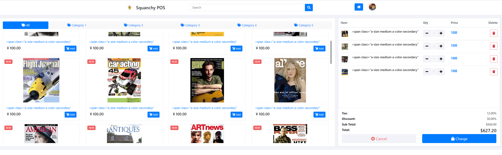

# aw06

[Amazon Review Data (2018)](https://nijianmo.github.io/amazon/index.html) has a huge products metadata set of multiple categories.

|category| reviews | metadata |
|--| -- | -- |
|Amazon Fashion|reviews (883,636 reviews)|metadata (186,637 products)|
|All Beauty|reviews (371,345 reviews)|metadata (32,992 products)|
|Appliances|reviews (602,777 reviews)|metadata (30,459 products)|
| ... |
|Tools and Home Improvement|reviews (9,015,203 reviews)|metadata (571,982 products)|
Toys and Games|reviews (8,201,231 reviews)|metadata (634,414 products)|
Video Games|reviews (2,565,349 reviews)|metadata (84,893 products)|

Please finish the following tasks:

- Download no less than two categories of these metadata.
- Referring the example code in this repo, convert each line in the downloaded files into a POJO of `Product` class and save the object in a database like MySQL. 
- Integrate the database containing Amazon products with your own AW04 project and build an Amazon WebPOS system.

And, of course, always try to make the system run as fast as possible.

# batch

数据：下载了Digital_Music和Video_Games两个数据集

策略：

- Batch部分采用partitioner，chunk大小1000
- Reader和Processor用的示例代码，将Json中的数据转化成`Product`类的POJO
- Writer用jdbcInsertTemplate将`Product`写入mysql数据库

用时：自己笔记本，CPU i7-10750H，跑完Job用时40s左右

# Webpos

和aw04基本一致，除了

- 显示产品列表时，由于数据库中的记录很多，两个数据集的数据加起来有约17w条。如果全部显示到前端的话渲染巨慢，前端也会崩，所以将repository从CrudRepository换成PagingAndSortingRepository，只显示30条商品。后续可以做一个翻页按钮。
- batch中解析metadata时，其中的price大量缺失，就没存入数据库，webpos中给每个商品斗设置了price=100
- batch中解析metadata时，title大多数是一个html，webpos中显示的商品名就比较奇怪

